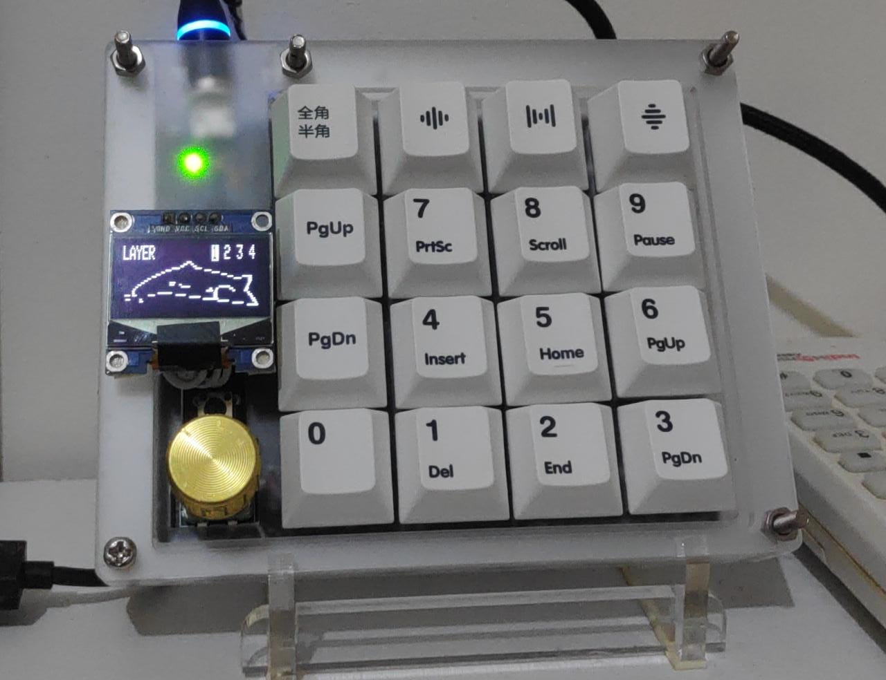

# dumbpad-oled-V1.2

<h3>Jika kalian tertarik untuk membuat custom keyboard namun bingung dengan firmware dari keyboardnya,kami menyediakna jasa pembuatan keyboard untuk keyboard jenis apapun dan layout apapun.Kalian bisa langsung cek tokopedia saya di tokopedia.com/reyhandwistore</h3>
  
<h3>If you are interested in making a custom keyboard but are confused about the firmware of the keyboard, we provide keyboard making services for any type of keyboard and any layout. You can directly check my tokopedia at <a>tokopedia.com/reyhandwistore</a></h3>

Halo semuanya, perkenalkan gua reyhandwirama. Disini gua ingin share kekalian firmware untuk pcb dumbpad oled version 1.2 by ichipwood. disini untuk firmwarenya gua menggunakan manufacture reyboard sebagai nama dari firmwarenya. semua fungsi bekerja dengan baik menggunakan vial/via. encoder dapat diremap dengan menggunakan vial. hope you like it and enjoy

Hello everyone, introduce me, Reyhandwirama. Here I want to share with you the firmware for the PCB dumbpad oled version 1.2 by ichipwood. here for the firmware I use manufacture reyboard as the name of the firmware. all functions work fine using vial/via. encoder can be remap using vial. hope you like it and enjoy

<strong>disini terdapat 2 firmware yaitu untuk oled yang berukuran 128x64 dan 128x32 dan menggunakan driver ssd1306, Pilih sesuai dengan oled yang kalian gunakan !</strong>

<strong>here there are 2 firmware, namely for oled measuring 128x64 and 128x32 and using the ssd1306 driver, choose according to the oled you are using !</strong>

cara remap dumbpad menggunakan aplikasi  vial

<ol>
   <li>buka aplikasi vial</li>
   <li>pilih menu file yang ada dipojok kiri atas</li>
   <li>pilih submenu sideload via json</li>
   <li>import file vial.json</li>
   <li>pencet tombol refresh pada aplikasi vial</li>
   <li>tombol dumbpad sudah bisa diremap</li>
</ol>

cara remap dumbpad menggunakan aplikasi via

<ol>
    <li>buka palikasi via</li>
    <li>buka tab settings</li>
    <li>aktifkan mode design</li>
    <li>buka tab desing</li>
    <li>klik tombol load lalu import file vial.json</li>
    <li>dumbpad sudah bisa diremap melali tab configure</li>
 </ol>
 
 
how to remap dumbpad using vial app

<ol>
   <li>open the vial app</li>
   <li>select the file menu in the upper left corner</li>
   <li>select sideload submenu via json</li>
   <li>import vial.json file</li>
   <li>press the refresh button on the vial</li>
   <li>The dumbpad buttons are remappable</li>
</ol>

how to remap dumbpad using app via

<ol>
    <li>open the application via</li>
    <li>go to settings tab</li>
    <li>enable design mode</li>
    <li>open design tab</li>
    <li>click the load button then import the vial.json file</li>
    <li>Dumbpad can be remapped via the configure tab</li>
 </ol>
